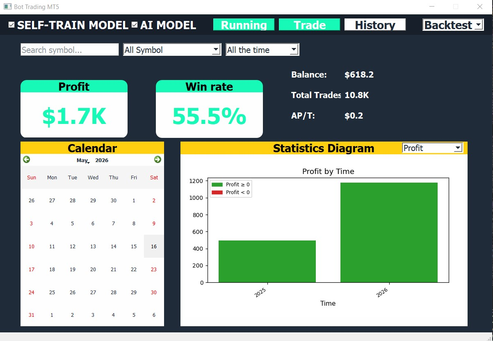
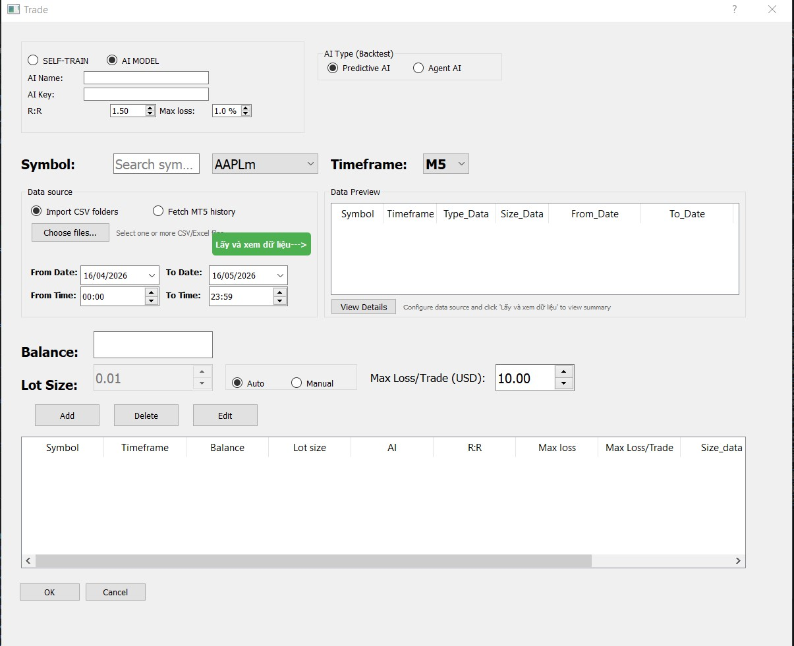
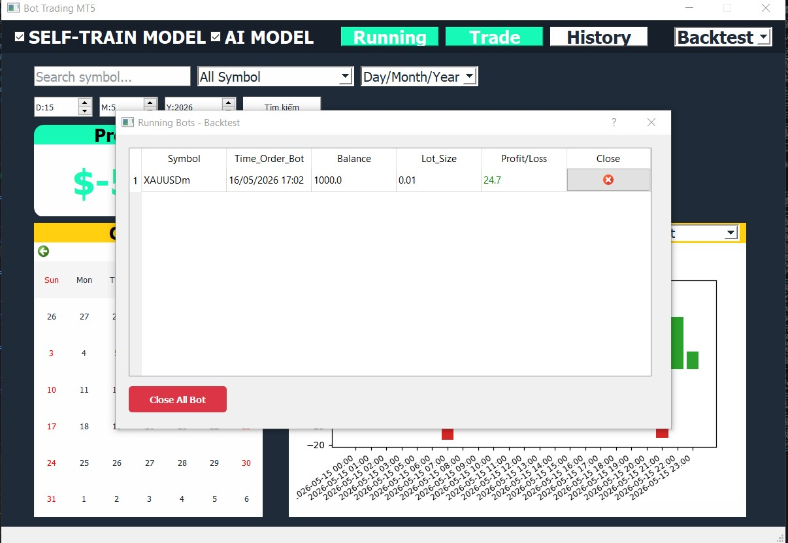

# Bot Trading MT5 — AI-Powered Algorithmic Trading System

End-to-end quantitative trading system combining Deep Reinforcement Learning (Dueling DDQN) with Large Language Model decision-making, integrated with MetaTrader 5 for live execution.

---

## Table of Contents

- [What This Project Demonstrates](#what-this-project-demonstrates)
- [Overview](#overview)
- [Backtest Results](#backtest-results)
- [Screenshots](#screenshots)
- [Key Features](#key-features)
- [System Architecture](#system-architecture)
- [Technology Stack](#technology-stack)
- [Project Structure](#project-structure)
- [Trading Modes](#trading-modes)
- [AI and Signal Engine](#ai-and-signal-engine)
- [Risk Management](#risk-management)
- [Desktop UI](#desktop-ui)
- [Installation](#installation)
- [Configuration](#configuration)
- [Disclaimer](#disclaimer)

---

## What This Project Demonstrates

- Designed and implemented a complete reinforcement learning pipeline from scratch: raw OHLC data, feature engineering (17 technical indicators), Dueling DDQN training on Kaggle GPU, backtesting, and live deployment via MetaTrader 5
- Integrated GPT-4o-mini as a real-time trading signal generator using structured prompt engineering — the model receives a rich JSON payload of 15+ indicators and returns a validated trade decision with entry, SL, TP, and expiry
- Built a production desktop application in PyQt5 supporting multi-symbol parallel trading, live bot monitoring, and interactive trade history analytics
- Implemented multi-layer risk management including margin validation, dynamic lot sizing, R:R filtering, and per-symbol position checks before every order

---

## Overview

This project is a production-grade algorithmic trading system built for MetaTrader 5, supporting two distinct AI-driven trading engines:

1. **Dueling DDQN Agent** — a custom PyTorch reinforcement learning model (3,065-dim state space, 17 hand-crafted technical features) trained on XAUUSD M1 data
2. **LLM-based Signal Engine** — real-time OpenAI API integration that receives a rich technical analysis payload and returns structured trade decisions (entry, SL, TP, pending timeout)

Both engines are wired to a full backtest and live trading pipeline with a PyQt5 desktop UI for monitoring, analytics, and control.

---

## Backtest Results

Backtest on **XAUUSDm (Gold) M1** using the trained PyTorch DuelingDQN model.
Data period: **October 2025 — March 2026** (6 months, 181 days).
Lot size: 0.01 | SL: 0.2% | TP: 0.3% | Cooldown: 30 candles after stop-loss.

| Metric | Value |
|---|---|
| Symbol | XAUUSDm (Gold) |
| Timeframe | M1 (1-minute candles) |
| Test Period | 2025-10-01 to 2026-03-31 |
| Total Trades | 10,798 |
| Wins / Losses | 5,990 / 4,808 |
| Win Rate | 55.5% |
| Net P/L | +$1,671.07 |
| Gross Win | $21,458.88 |
| Gross Loss | $19,787.81 |
| Profit Factor | 1.08 |
| Avg Win / Trade | +$3.58 |
| Avg Loss / Trade | -$4.12 |
| Best Trade | +$28.77 |
| Worst Trade | -$123.82 |
| Max Drawdown | -$289.52 |
| Avg Trades / Day | 59.7 |
| ROI (vs $10,000) | +16.7% |
| Model | PyTorch Dueling DDQN |
| Lot Size | 0.01 (micro lot) |

---

## Screenshots

### Main Dashboard



Profit: **$1.7K** | Win Rate: **55.5%** | Total Trades: **10.8K** | AP/T: **$0.2**

### Trade Setup Dialog



AI source selection (Self-Train / AI Model), symbol + timeframe picker, data source (CSV import or MT5 fetch), lot sizing, and per-row AI config.

### Running Bots Monitor



Live table showing active bots: Symbol, start time, balance, lot size, running P/L, and individual close button.

---

## Key Features

| Feature | Details |
|---|---|
| Dueling DDQN | Custom PyTorch model · 3,065-dim state · 17 features · 180-candle lookback |
| LLM Trading | OpenAI API (GPT-4o-mini) · structured JSON output · prompt-engineered payload |
| Rich Payload Builder | 15+ indicators per candle · pattern detection · breakout signals · S/R levels |
| Dual Backtest Engine | DDQN agent backtest + LLM API backtest on historical CSV data |
| Live MT5 Integration | Pending/market orders · dynamic lot sizing · retry logic · intra-bar SL/TP |
| Risk Management | Max loss % · max loss per trade (USD) · R:R filter · margin check |
| Desktop UI | PyQt5 dashboard · multi-bot monitor · trade history viewer · equity chart |
| Trade History CSV | Full OHLC + 10 indicators per trade · win/loss · AI model tag |

---

## System Architecture

```
+------------------------------------------------------------------+
|                        PyQt5 Desktop UI                          |
|   Main Dashboard  |  Trade Setup  |  Bot Monitor  |  History     |
+-----------------------------+------------------------------------+
                              |
                    +---------+---------+
                    |   Trading Engine  |
                    +---------+---------+
                              |
               +--------------+---------------+
               |                              |
      +--------+--------+          +----------+----------+
      |   DDQN Agent    |          |    LLM Engine       |
      |   PyTorch       |          |    OpenAI API       |
      |   DuelingDQN    |          |    GPT-4o-mini      |
      +--------+--------+          +----------+----------+
               |                              |
               |                   +----------+----------+
               |                   |   Payload Builder   |
               |                   |   15+ indicators    |
               |                   |   Pattern detect    |
               |                   +----------+----------+
               |                              |
               +--------------+--------------+
                              |
                   +----------+----------+
                   |   MetaTrader 5      |
                   |   Live Orders       |
                   |   SL / TP / Pending |
                   +---------------------+
```

---

## Technology Stack

| Category | Technologies |
|---|---|
| Language | Python 3.11+ |
| Deep Learning | PyTorch, Dueling DQN, Stable Baselines3 |
| LLM Integration | OpenAI API (GPT-4o-mini / GPT-4o) |
| Trading Platform | MetaTrader 5 (Python API) |
| Technical Analysis | `ta` library, RSI, MACD, Bollinger Bands, ATR, Stochastic, Williams %R, EMA |
| Data Processing | NumPy, Pandas |
| Desktop UI | PyQt5 |
| Logging | Python logging, YAML config |

---

## Project Structure

```
Bot_trading_mt5/
|
+-- AI Trading Engines
|   +-- live_trade_ai.py              # Live trading — LLM decision engine
|   +-- Backtest_trade_ai.py          # Backtest — LLM API on historical data
|   +-- LiveTrade_AgentAI_MT5.py      # Live trading — PyTorch DDQN agent
|   +-- run_realtime_AgentAI.py       # Live trading — Stable Baselines3 DQN
|   +-- Backtest_tradeAgentAI.py      # Backtest — PyTorch DDQN agent
|
+-- Signal and Payload Engine
|   +-- ai_client.py                  # OpenAI API client, response validation
|   +-- Build_PayLoad.py              # Full indicator payload for LLM (15+ signals)
|   +-- scalping_payload.py           # Scalping-optimized payload builder
|
+-- Desktop UI (PyQt5)
|   +-- frame.py                      # Main window, dashboard, navigation
|   +-- ui_trade.py                   # Trade setup dialog, multi-symbol, AI config
|   +-- ui_running.py                 # Live bot monitor, status table
|   +-- ui_history.py                 # Trade history viewer, filters
|   +-- historytable.py               # Trade table model
|
+-- Utilities
|   +-- utils_account.py              # MT5 account info, balance, CSV helpers
|   +-- utils_logs.py                 # Equity tracking, running P&L log
|   +-- utils_paths.py                # Directory path helpers
|   +-- utils_symbols.py              # MT5 tradeable symbol discovery
|   +-- utils_symbol_csv.py           # Per-symbol CSV state management
|   +-- utlls_save_history.py         # Trade history CSV writer
|   +-- utils_messagebox.py           # UI message box helper
|
+-- Configuration
|   +-- SYMBOLs.py                    # Auto-discovers tradeable symbols from MT5
|   +-- config/                       # YAML logging configs per module
|   +-- .env.example                  # Environment variable template
|   +-- key_api.txt                   # API key storage (gitignored)
|
+-- DDQN Model Pipeline
|   +-- DDQN_TradingAgent/
|       +-- kaggle_training.py        # Training script (Kaggle/local GPU)
|       +-- checkpoints/              # Saved model weights (gitignored)
|
+-- Data and Results (gitignored)
    +-- results/trade_history/        # Real-time trade logs (per symbol CSV)
    +-- results/backtest/             # Backtest output CSVs
    +-- logs/                         # Runtime logs
```

---

## Trading Modes

### LLM-Powered Live Trading (`live_trade_ai.py`)

- Triggers on candle close (UTC+7 aligned)
- Builds a comprehensive JSON payload: 15+ indicators, 20 recent candles, S/R levels, pattern detection, price velocity
- Calls OpenAI API and receives a structured decision: `signal`, `entry_price`, `stop_loss`, `take_profit`, `pending_timeout_sec`
- Places pending orders (Buy/Sell Limit/Stop) with GTC or time-limited expiry
- Retries up to 60 times on execution failure

### DDQN Agent Live Trading (`LiveTrade_AgentAI_MT5.py`)

- Loads pre-trained PyTorch `DuelingDQN` or Stable Baselines3 `DQN` model
- State: 3,065-dimensional — 180 candles x 17 features + 5 position features
- 17 features: `returns`, `rsi`, `trend`, `atr`, `macd_hist`, `volatility`, `hour_sin/cos`, `day_sin/cos`, `dist_max/min`, `body_size`, `wick_size`, `bb_pct_b`, `bb_width`, `log_vol`
- Action space: HOLD, BUY, SELL, CLOSE
- Intra-candle SL (0.2%) / TP (0.3%) with 30-candle cooldown after stop-loss

### Backtest — LLM API (`Backtest_trade_ai.py`)

- Runs on imported CSV or MT5 historical data
- Simulates candle-by-candle with pending order timeout logic
- Evaluates SL/TP hit per candle via high/low comparison
- Saves full trade log to `results/backtest/`

### Backtest — DDQN Agent (`Backtest_tradeAgentAI.py`)

- Loads `best_model.pth` PyTorch checkpoint
- Preprocesses data identically to the training pipeline (rolling normalization)
- Simulates gap fills, intra-candle SL/TP, and cooldown periods
- Prints final summary: win rate, total P/L, ROI

---

## AI and Signal Engine

### LLM Payload (`Build_PayLoad.py` / `scalping_payload.py`)

Each payload sent to the LLM includes:

```
Indicators (per bar):
  EMA 5/9/21, RSI(7), RSI(14), MACD(5,13), Stochastic(5), Williams %R
  Bollinger Bands(10, 1.5 sigma), ATR(7), Price Momentum, Price Velocity
  EMA Alignment, Volatility %, Scalping Signals

Price Action:
  Last 20 candles (OHLC + direction)
  Trend 5/10 bar, consecutive direction, momentum acceleration
  Current candle pattern (Doji, Hammer, Engulfing, Inside/Outside Bar)

Market Structure:
  Session high/low, Key S/R levels, Breakout signals
  Pivot highs/lows, Volume trend, Gap detection
  Triangle / Rectangle / Flag pattern detection

Output expected from LLM:
  {
    "signal": "buy | sell | hold",
    "entry_price": float,
    "stop_loss": float,
    "take_profit": float,
    "pending_timeout_sec": int,
    "confidence": float
  }
```

### DDQN Model Architecture

```python
DuelingDQN(
  input_dim  = 3065,   # 180 candles x 17 features + 5 position features
  hidden_dim = 512,
  output_dim = 4       # HOLD / BUY / SELL / CLOSE
)

Feature layers : Linear -> LayerNorm -> LeakyReLU (x2)
Value stream   : Linear(512->256) -> LeakyReLU -> Linear(256->1)
Advantage stream: Linear(512->256) -> LeakyReLU -> Linear(256->4)
Q = V + (A - mean(A))
```

Training: Kaggle GPU, Prioritized Experience Replay, k-fold validation, rolling normalization

---

## Risk Management

Every trade goes through a multi-layer risk check before execution:

| Check | Description |
|---|---|
| Margin check | `mt5.order_calc_margin()` vs free margin before placing order |
| Max loss % | Adjusts lot size downward step-by-step until risk is within threshold |
| Max loss per trade (USD) | Calculates lot from SL distance using `mt5.order_calc_profit()` |
| R:R filter | Rejects trades where reward/risk ratio is below configured minimum |
| Balance check | Stops bot if balance reaches zero |
| Symbol trading check | Skips symbol if an open position or order already exists |

---

## Desktop UI

### Main Dashboard (`frame.py`)

- Mode selector: Real-time / Backtest
- Symbol search and dropdown
- Time range filter: All / Day / Month / Year
- Metric toggle: Profit / Total Trades (bar chart)
- Source filter: Self-trained DDQN / AI Model (LLM)
- Summary cards: Profit, Win Rate, Balance, Total Trades, Avg P/T

### Trade Setup Dialog (`ui_trade.py`)

- AI source: Self-train (DDQN) or AI Model (LLM)
- LLM config: API key, model name, endpoint, R:R, max loss %
- AI type: Predictive AI / Agent AI
- Symbol and timeframe selection (M1 / M5 / M15 / M30 / H1 / H4 / D1)
- Backtest data: Import CSV/Excel or fetch from MT5 with date range picker
- Lot mode: Manual or Auto with Max Loss/Trade in USD
- Per-row AI key for multi-symbol parallel trading

### Bot Monitor (`ui_running.py`)

- Live table: Symbol, Start time, Balance, Lot, Running P/L
- Stop individual bot or close all bots
- Equity logs: `Equity_Realtime.csv` / `Equity_Backtest.csv`

### Trade History (`ui_history.py`)

Columns: `Datetime`, `Timeframe`, `Side`, `Entry`, `SL`, `TP`, `RSI`, `MACD`, `EMA`, `BB`, `ATR`, `Lot`, `Profit`, `Win`, `AI`

---

## Installation

```bash
# 1. Clone repository
git clone https://github.com/DATCAOTAN/Bot_trading_mt5.git
cd Bot_trading_mt5

# 2. Create virtual environment
python -m venv venv
venv\Scripts\activate

# 3. Install dependencies
pip install -r requirements.txt

# 4. Configure API key (choose one method — see Configuration below)

# 5. Launch the app
python app.py
```

Requirements: Python 3.11+, MetaTrader 5 terminal (for live trading), OpenAI API key (for LLM mode)

---

## Configuration

### API Key

```bash
# Method 1: paste key into key_api.txt (gitignored)
echo YOUR_OPENAI_KEY > key_api.txt

# Method 2: environment variable
set OPENAI_API_KEY=YOUR_OPENAI_KEY

# Method 3: enter directly in the Trade Setup dialog inside the app
```

### DDQN Model

Place your trained checkpoint at:

```
DDQN_TradingAgent/gemini3_vibe_code_AgentMT5/best_model.pth
```

Train from scratch:

```bash
python DDQN_TradingAgent/gemini3_vibe_code_AgentMT5/kaggle_training.py
```

### Trade History CSV Schema

| Column | Description |
|---|---|
| `Datetime_entry` | Entry timestamp |
| `Time_frame` | M1 / M5 / M15 / M30 / H1 / H4 / D1 |
| `Sell/Buy` | Trade direction |
| `Entry_price`, `Stop_loss`, `Take_profit` | Price levels |
| `RSI`, `MACD_value/signal/histogram` | Indicators at entry |
| `EMA_50`, `EMA_200`, `BB_upper/middle/lower`, `ATR14` | Additional indicators |
| `Lot`, `Profit`, `Win` | Trade result |
| `AI` | Model tag (gpt-4o-mini, PyTorch_DuelingDQN, etc.) |

---

## Disclaimer

This project is for research and educational purposes only.
It does not constitute financial advice or a recommendation to trade.
Trading involves significant risk of loss. Use at your own risk.
